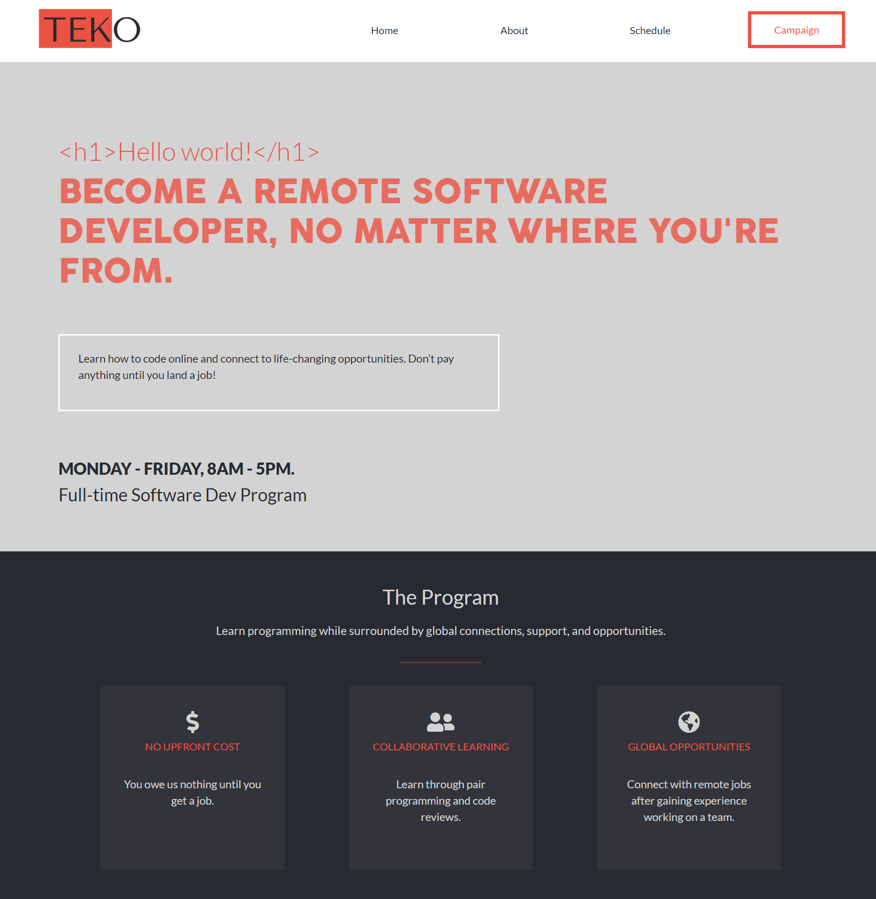

# HTML/CSS Capstone Project

> This is the HTML/CSS Capstone project for Microverse. It contains a website that has been designed to certain specifications given and was built using HTML/CSS and Bootstrap.

The design features:

- 3 pages. Home, About & Schedule.
- Responsive mobile-first design on all pages.
- Use of 3 main colors which were given through specifications.
- Use of 2 fonts which were given through specifications.

Design idea/specifications by [Cindy Shin in Behance](https://www.behance.net/adagio07)

Additional description about the project and its features.

## Built With

- HTML/CSS
- Bootstrap

## Live Demo

[Click here to view the website](https://ryelbanfield.github.io/HTML-CSS-Capstone-Project/)

## Authors

👤 **Author1**

- GitHub: [@RyelBanfield](https://github.com/RyelBanfield)
- Twitter: [@RyelBanfield](https://twitter.com/RyelBanfield)
- LinkedIn: [Ryel Banfield](https://www.linkedin.com/in/ryel-banfield-93a6a71b4/)

## Show your support

Give a ⭐️ if you like this project!

## 📝 License

This project is [MIT](LICENSE) licensed.
